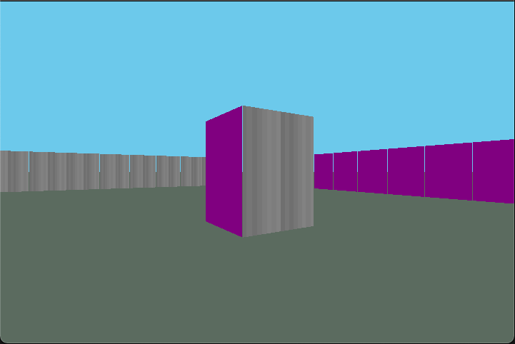
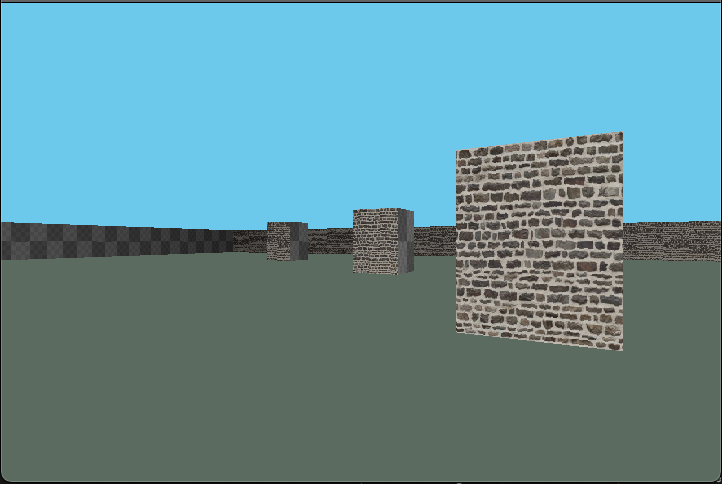
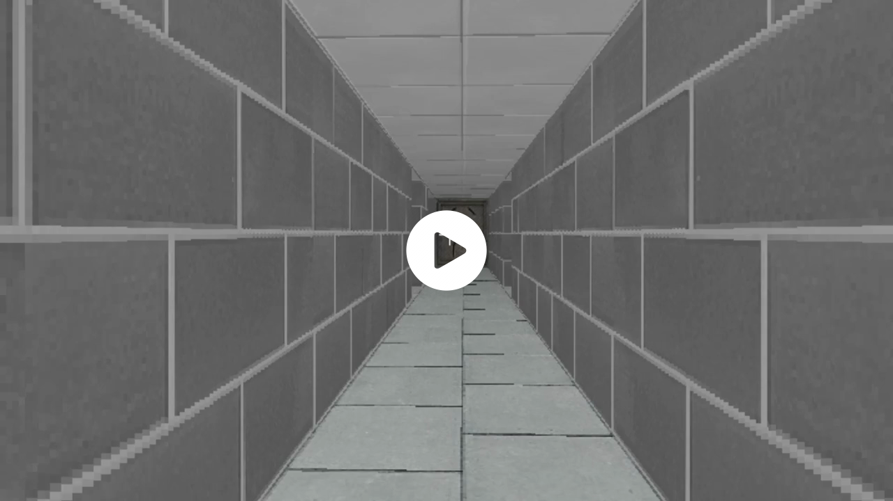

# fps - First Person Raycaster
Raycaster made by me, algorithms inspired by online sources.

* If you have ideas, you can post them on [this Google Doc](https://docs.google.com/document/d/1FT-uGfJ4u9irJ9EBzfeAzoy5IvE1mD8UnRtnMjZ8P5U/edit?usp=sharing). Please follow the guidelines posted there.
* Uses C++ and SDL 2
* Support for Windows: extract `game-i686.zip` (32-bit) or `game-x86_64.zip` (64-bit) and run the executable. If you have problems, create an issue.
* As of 2022-01-14, this works on Linux. If you are using g++ < 9, uncomment the `-lstdc++fs` so that it has the standard file system library.
* `make` to compile. Comment the `--debug` in like the third line of the makefile and then `make redo` to get a non-debug binary, which might be a bit faster.
	* Cross compiling may or may not work for you. It works for me on a Mac with mingw.
	* Set the environment variable CROSS to either i686 (32-bit) or x86\_64 (64-bit) to cross compile.
	* The windows-build shell script builds the zips automatically when run
* Textures that aren't lame are from Cube 2: Sauerbraten. Check out the `locations.txt` file there.

## Blog I Guess
1.  
   2021-12-21 at 11.29.36: Single ray is stopping at the right time.

2.  
   2021-12-21 at 13.36.45: Multiple rays cast at once in a 2D environment.

3.  
   2021-12-21 at 15.13.59: Mapping to columns to simulate 3D is working, but the fish eye fix is not

4.  
   2021-12-23 at 09.28.56: Fisheye is fixed but now there's a problem with slight angles going through walls.

5.  
   2021-12-23 at 11.55.53: Wall glitch fixed.

6.  
   2021-12-23 at 17.08.09: Face shading added

7.  
   2021-12-24 at 11.03.21: Movement and turning is improved, and face shading supports more than 2 sides.

8.  
   2021-12-24 at 12.20.30: Tried adding a sky and ground

9.  
   2021-12-24 at 13.39.04: Added collisions

10.  
   2021-12-24 at 17.02.29: Added single color textures 
   

11.  
   2021-12-24 at 17.28.25: Textures are working 
   

12.  
   2021-12-26 at 16.22.01: Added floor and ceiling, but now it's very slow.

13.  
   2021-12-26 at 19.18.28: Optimized the floors and ceiling

14.  
   2021-12-28 at 10.39.13: Added display of heading and fps

15.  
   2021-12-28 at 12.50.11: Refactored to use surfaces (CPU-based rendering). Much more efficient for this ray caster.

16.  
   2021-12-28 at 14.41.30: Sort of fixed the bug with close walls being glitched

17.  
   2021-12-29 at 13.05.33: Added texture editing

18.  
   2021-12-31 at 14.38.47: Game running on Windows! *Video by J-Toastie*

19.  
   2022-01-03 at 16.42.25: Added some GUI stuff and input boxes

20.  
   2022-01-05 at 21.20.41: Fleshed out GUI system

21.  
   2022-01-16 at 12.38.08: Map listing, wall editor, new map button

